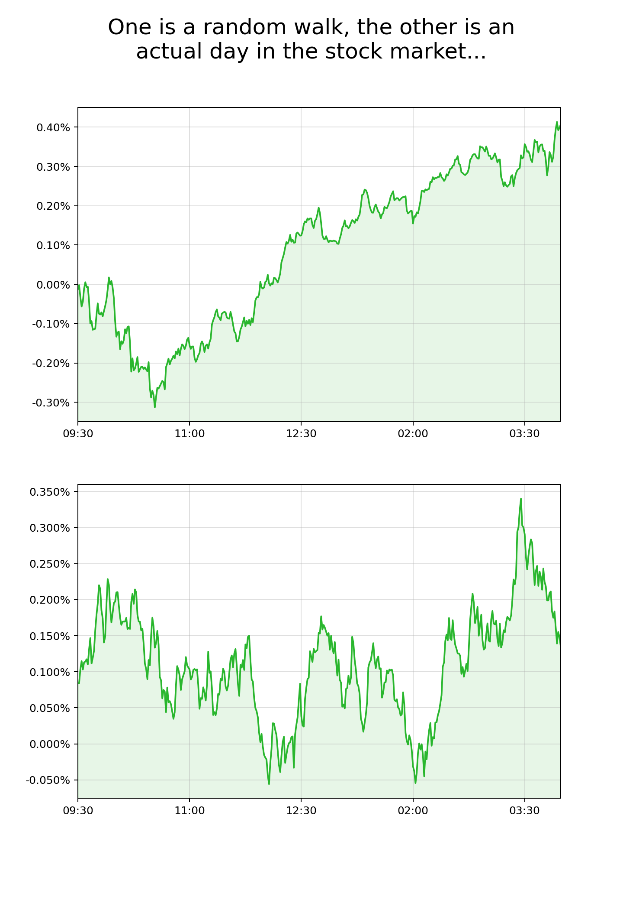

# random_stocks

Do you think you can tell the difference between a random walk and a day of the S&P 500?
Play this game to find out!

You just need to run `game.py` which loads data from the `.npy` files. An interactive game from a python command line is indeed, pretty lame. I'm looking forward to this game being hosted on a website. It would be pretty funny if even financial wizards couldn't do statistically significantly better than random guessing. 

I'm likely about to purchase minute by minute data on the S&P 500 from 2004, giving this game a repository of ~4,000 trading days to choose from. 
